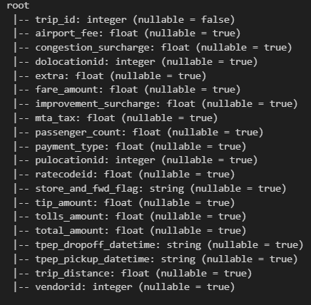
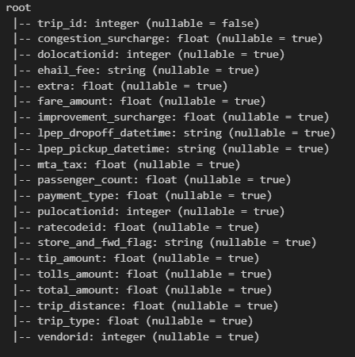

# Simulate data warehouse in Microsoft SQL Server

## Prerequisites
- Install SQL Server Management Studio (SSMS) and Microsoft SQL Server Developer Edition

## Run script to create data warehouse in SQL Server 

[Schema](schema/Schema.sql)

## Data Modelling : 
The data warehouse includes : 
Dim Tables : Dim_zone, Dim_date, Dim_rate, Dim_payment, Dim_trip, Dim_vendor, DIm_flag
Transaction Fact Tables : green_fact_trips , yellow_fact_trips

### Yellow Fact Trip Table

### Green Fact Trip Table
